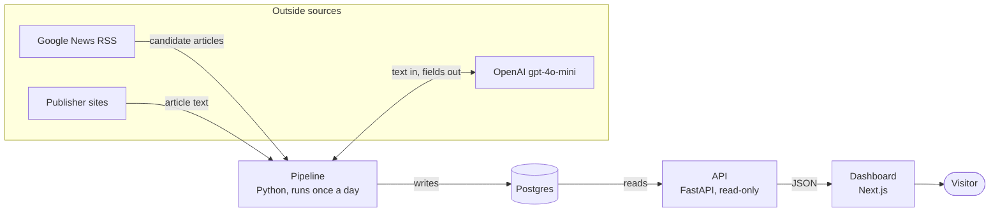
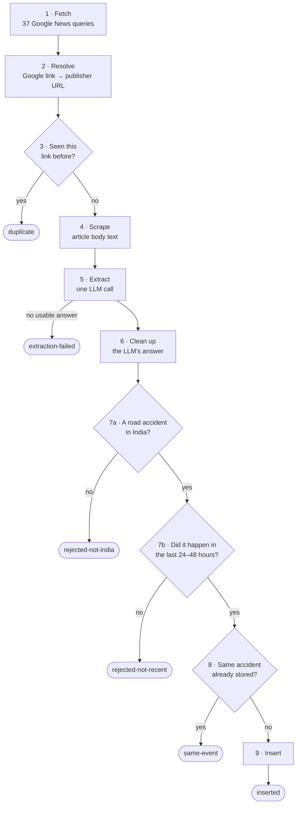
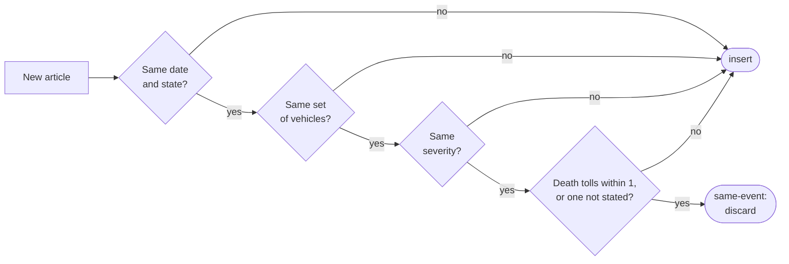
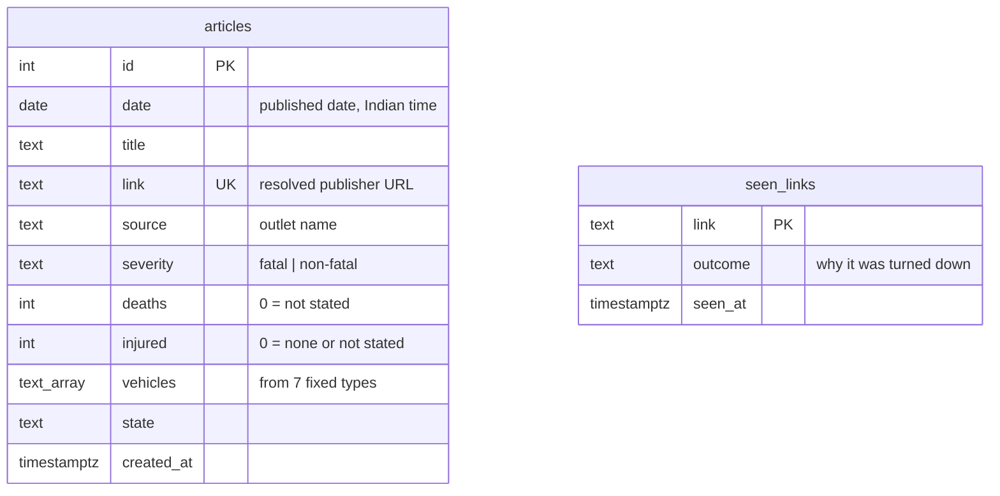
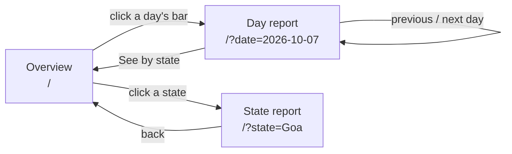

# Indian Traffic Accident News Aggregator

A dashboard of road accidents in India, built from the news. Once a day a pipeline collects that day's accident reports from Indian news outlets, uses an LLM to turn each article into structured data (how severe, how many dead and injured, which vehicles, which state), removes repeat coverage of the same accident, and stores the result. A web dashboard shows the numbers by day, by month and by state, with a link back to every source article.

Everything shown is extracted automatically from news articles and can contain mistakes. The counts are a picture of what was *reported*, not official statistics.

## What the dashboard shows

| View | What you see |
|---|---|
| **Overview** | The latest day's accidents, deaths and injuries with the change from the day before; daily and monthly bar charts split into fatal and non-fatal; a map of India with a bubble per state and a ranking |
| **Day report** | One day's totals, a strip to jump to any other day, and every article for that day with its severity, vehicles, state and source link |
| **State report** | One state's totals and articles for a day, a month, or all time |

## Architecture

There are four parts. Three run all the time; the pipeline runs for a few minutes a day and stops.



| Part | Technology | Job |
|---|---|---|
| Pipeline | Python (`backend/run_pipeline.py`) | Collect, extract, de-duplicate and store the day's articles |
| Database | Postgres | One row per accident, plus a memory of links already turned down |
| API | FastAPI (`backend/api.py`) | Serve totals and article lists; never writes |
| Dashboard | Next.js 16, React 19, Tailwind 4 (`frontend/`) | Render the three views; fetches from the API on the server |

The pipeline and the API share the same code and database but never call each other. The only thing connecting them is the data.

## The pipeline, stage by stage

This is the heart of the project. Each article goes through the stages below and ends with exactly one outcome.



### 1. Fetch

`backend/fetch.py` queries Google News RSS for accident stories from the last 24 hours.

Google's "India edition" setting is only a bias, not a filter: a single India-wide query comes back full of stories from other countries. So the same accident query is run once per state and union territory, with the name as a required phrase, plus once for "India". That is 37 requests per run. Results are merged, and an article that comes back for more than one region is kept once.

Nothing is filtered here. Every result is a candidate for the LLM to judge.

### 2. Resolve

Google News does not give the article's real address, only an opaque redirect link. `fetch_body.resolve_url` decodes it into the publisher's URL. If decoding fails, the article is kept anyway, with the Google link and headline-only extraction.

### 3. Skip links already seen

Before any expensive work, each link is checked against two lists: articles already stored, and links that were looked at and turned down in the last 7 days. A known link stops here as `duplicate`. This makes a rerun nearly free and stops a borderline article getting a second verdict.

### 4. Scrape

`fetch_body.get_article_text` downloads the publisher's page and strips navigation, ads and boilerplate, keeping up to 3,000 characters of body text. A paywall, a block or a dead link yields nothing, and the article continues with its headline alone.

### 5. Extract

`extract.extract_fields` sends the title and body to the LLM in a single call that does two jobs at once: judge whether the article belongs, and pull out the fields.

```json
{
  "is_india_traffic_accident": true,
  "is_recent_accident": true,
  "severity": "fatal",
  "deaths": 3,
  "injured": 5,
  "vehicles": ["Car", "Truck"],
  "state": "Uttar Pradesh"
}
```

| Field | Meaning |
|---|---|
| `is_india_traffic_accident` | False for another country, or for a "crash" that isn't a road accident |
| `is_recent_accident` | False for an old accident back in the news through a verdict, compensation award, arrest or anniversary |
| `severity` | `fatal` if the article says someone died; otherwise `non-fatal`, which also covers "the article doesn't say" |
| `deaths`, `injured` | The stated numbers; 0 when none is stated |
| `vehicles` | Any of seven fixed types: Auto-rickshaw, Bus, Car, Tractor, Truck, Two-wheeler, Van |
| `state` | One of the 36 states and union territories, or `Unknown` |

The LLM does the translating: the prompt tells it, for example, that an SUV is a Car, a lorry is a Truck and a pickup is a Van. An LLM was chosen over keyword rules because rules are brittle, need constant upkeep, and can match the wrong word without any sign that they did.

### 6. Clean up the answer

The code does not trust the LLM to follow the rules, so it enforces them:

- A stated death toll always makes the article `fatal`.
- Any severity other than `fatal` becomes `non-fatal`.
- A count that isn't a plain number ("several") becomes 0.
- Vehicle names outside the fixed list are dropped; the rest are de-duplicated and sorted.

The database repeats these rules as constraints, as a last line of defence.

### 7. Relevance gates

An article is kept only if both flags are true. Otherwise it ends as `rejected-not-india` or `rejected-not-recent`, and its link is remembered so it is never processed again.

### 8. Same accident, different outlet

One accident is often covered by several outlets. `store.save_article` treats a new article as a repeat when an existing row matches on all of these:



The first article stored stays; later ones are discarded. Injury counts are deliberately not compared, because outlets disagree on them too much. An article with no known state is never matched.

This is a heuristic. It can miss a repeat when outlets describe the vehicles or the toll differently, so some accidents are stored more than once and the totals are somewhat overstated.

### 9. Insert

A surviving article becomes one row in `articles`.

### Outcomes

Every run prints one line per article and a summary of these counts.

| Outcome | Meaning | Tried again next run? |
|---|---|---|
| `inserted` | Stored as a new accident | — |
| `duplicate` | Link already stored or already turned down | No |
| `same-event` | Another outlet's report of this accident is already stored | No |
| `rejected-not-india` | Not a road accident in India | No |
| `rejected-not-recent` | An old accident resurfacing | No |
| `extraction-failed` | The LLM call failed or returned something unusable | Yes |
| `error` | Something else went wrong for this article | Yes |

One bad article never stops the run. The slow, network-bound stages (resolve, scrape, extract) run on eight threads; everything touching the database runs on one thread in feed order, because the same-event check depends on which article was stored first.

## Data model



- `date` is when the article was **published**, not when the accident happened. A late report therefore never changes a day that has already been viewed.
- `seen_links` is pruned after 7 days; the feed only reaches back one day, so older links never return.
- Because 0 stands for "not stated", death and injury totals are lower bounds.

## API

Read-only. "Totals" always means the same five numbers: `accidents`, `fatal`, `non_fatal`, `deaths`, `injured`.

| Endpoint | Returns |
|---|---|
| `GET /stats/daily` | Totals for every day that has data |
| `GET /stats/states` | Totals per state for a day (`?date=`), a month (`?month=`) or all time |
| `GET /articles` | An article list with its totals, filtered by `date`, `month`, `state` and `severity`, paged with `limit` and `offset` |
| `GET /health` | `{"status": "ok"}` |

## Dashboard



The view and everything selected in it live in the URL, so any view can be linked to and the back button works. Data is fetched on the server; the browser never calls the API directly.

## Repository layout

```
backend/
  fetch.py            stage 1: Google News RSS
  fetch_body.py       stages 2 and 4: resolve redirect, scrape body
  extract.py          stages 5 and 6: LLM prompt, fixed lists, cleanup
  store.py            stages 3, 8 and 9: known links, same-event check, insert
  run_pipeline.py     runs the stages end to end
  api.py              the API
  db.py, schema.sql   connection and database schema
  backfill_*.py       one-off scripts that upgraded older rows
  tests/              test suite
frontend/             the Next.js dashboard
mock_ui/index.html    the design mockup the dashboard was built from
PROJECT_SPEC.md       detailed reference: decisions, edge cases, known gaps
render.yaml           an earlier Render deployment plan (see "Deployment")
```

## Running it locally

You need Python 3.12, Node 20, a local Postgres, and an OpenAI API key.

**Backend**

```bash
cd backend
python -m venv .venv && .venv/bin/pip install -r requirements.txt
createdb accident_news
cp .env.example .env          # then set OPENAI_API_KEY

.venv/bin/python run_pipeline.py --dry-run --limit 10   # try it without writing
.venv/bin/python run_pipeline.py                        # a real run
.venv/bin/uvicorn api:app --port 8000                   # start the API
```

**Frontend**

```bash
cd frontend
npm install
cp .env.example .env.local    # points at http://localhost:8000
npm run dev                   # http://localhost:3000
```

## Tests

From `backend/`:

| Command | What it runs |
|---|---|
| `pytest` | The main suite: pipeline, dedup, storage and API. No LLM calls. Needs a Postgres database named `accident_news_test` |
| `pytest -m llm` | Live checks that the prompt maps real wording to the right fields ("lorry" → Truck, "several killed" → fatal with no count). Calls OpenAI; costs well under a cent |

## Deployment

Not deployed yet. `render.yaml` describes an earlier plan (Render for the database, API and a daily cron job, Vercel for the dashboard). Hosting everything on Vercel with a daily trigger for the pipeline is being considered instead.

## Known limitations

- **Repeat coverage inflates totals.** The same accident is sometimes stored more than once.
- **Numbers are lower bounds.** Articles that give no count add 0 deaths or injuries.
- **One article, one accident.** A report that bundles two accidents becomes a single row.
- **English-language search.** The Google News queries are in English, so coverage of regional-language outlets is partial.
- **Reported date, not accident date.** Days reflect when an article was published.

`PROJECT_SPEC.md` has the full list, with the reasoning behind each design decision.
